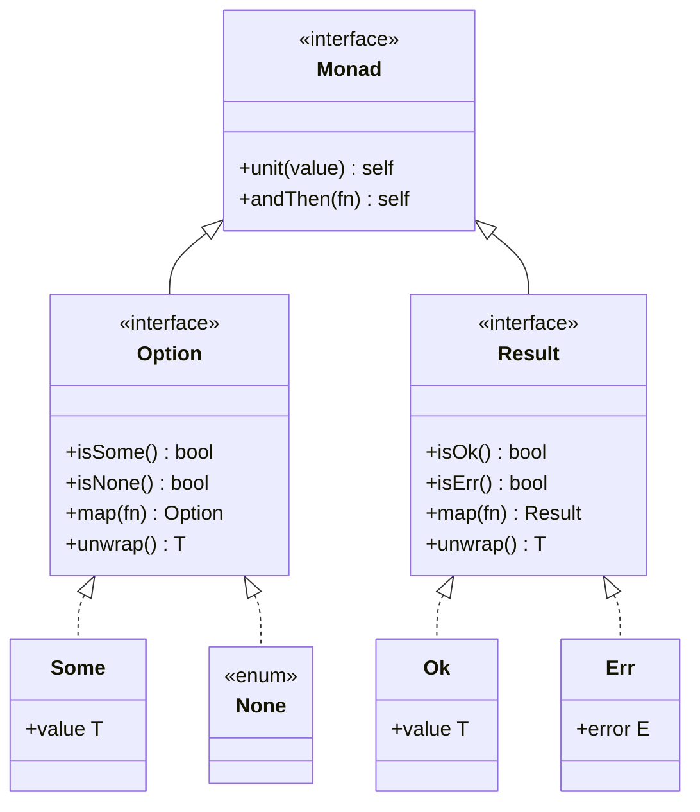

## クイックスタート

### インストール

```bash
composer require endoumame/php-monad
```

### Option の使用例

```php
use EndouMame\PhpMonad\Option;

// 値を Option でラップ
$value = Option\some(42);           // Some<int>
$empty = Option\none();             // None

// null かもしれない値を安全に処理
$name = Option\fromValue($user['name'] ?? null);

$result = $name
    ->map(fn($n) => strtoupper($n))      // 値があれば変換
    ->filter(fn($n) => strlen($n) > 0)   // 条件で絞り込み
    ->unwrapOr('Anonymous');              // None なら代替値
```

### Result の使用例

```php
use EndouMame\PhpMonad\Result;

// 成功 / 失敗を明示的に表現
$success = Result\ok(42);           // Ok<int>
$failure = Result\err('error');     // Err<string>

// 例外を Result に変換
$result = Result\fromThrowable(
    fn() => json_decode($json, flags: JSON_THROW_ON_ERROR),
    fn(Throwable $e) => "JSON パースエラー: {$e->getMessage()}"
);

$data = $result
    ->map(fn($decoded) => $decoded['key'])
    ->unwrapOr(null);
```

## アーキテクチャ



## 要件

- PHP 8.3 以上

## ライセンス

MIT License
